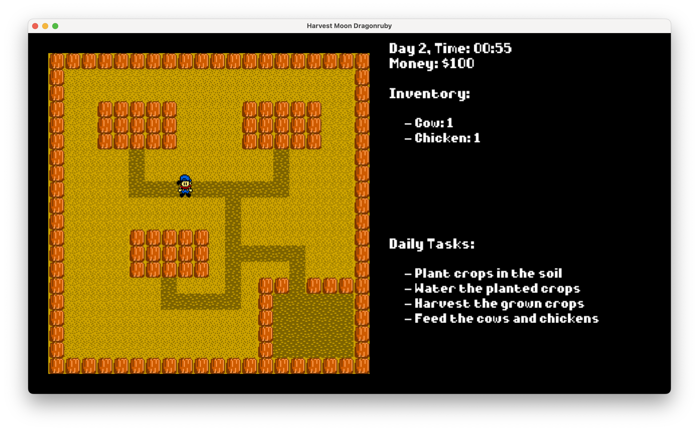

# Harvest Moon DragonRuby

A Harvest Moon-inspired farming simulation game built with DragonRuby GTK.



## Setup

### Prerequisites

- [DragonRuby GTK](https://dragonruby.org/toolkit/game)
- [Smaug](https://github.com/ereborstudios/smaug)

### Installation

Clone this repository:
```bash
git clone https://github.com/webmatze/harvest-moon-dragonruby.git
cd harvest-moon-dragonruby
```

Install dependencies using Smaug:
```bash
smaug install
```

### Running the Game

To run the game, use the following command:

```bash
smaug run
```